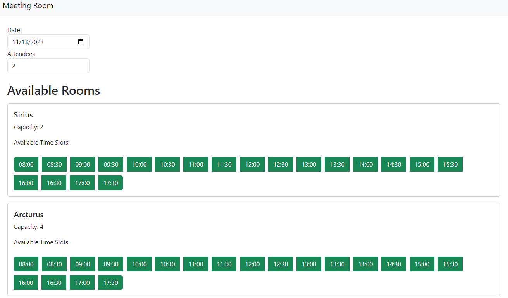
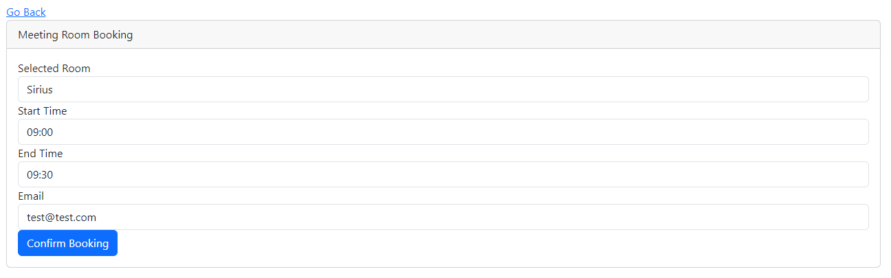

# Full Stack Meeting Room FRONTEND

This is the frontend codebase for a Full Stack Meeting Room application built with [React](https://reactjs.org/).

## Table of Contents

- [Features](#features)
- [Prerequisites](#prerequisites)
- [Folder Structure](#folder-structure)
- [Dependencies](#dependencies)

## Features

- Filter rooms by date and capacity
- View available rooms and timeslots
- Book a meeting room with specified start/end time.

## Prerequisites

Before running the application, ensure you have the following installed:

- [Node.js](https://nodejs.org/)

## Folder Structure
The project structure follows a typical React application setup:

```bash
frontend/
  ├── src/
  │   ├── components/
  │   ├── css/
  │   ├── App.js
  │   ├── index.js
```

- `src/`: Contains the source code for the React application.
- `components/`: React components used in the application.
- `css/`: Stylesheets for styling components.

## Dependencies

- [Bootstrap](https://getbootstrap.com/): Front-end framework for styling.
- [React](https://reactjs.org/): JavaScript library for building user interfaces.
- [React Router](https://reactrouter.com/): Declarative routing for React.



